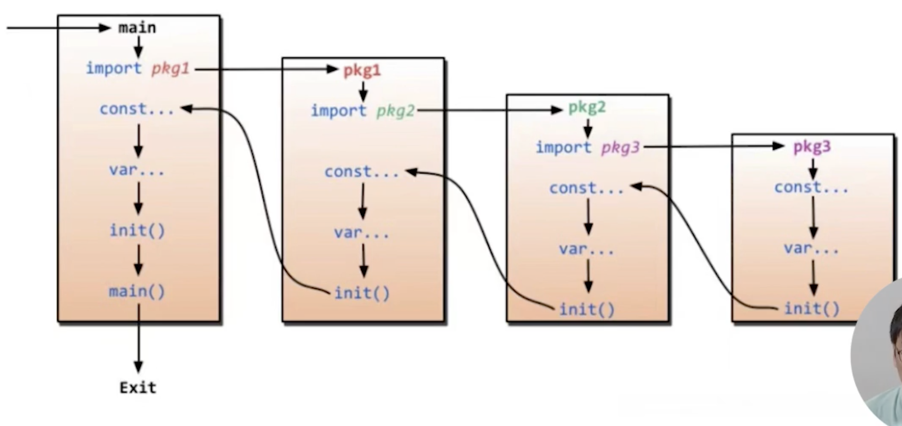

**go语言特性**

+ Go 语言由来和特性
+ Go 语言环境设置
    - [Hello world](./hello_world/main.go)
    - [testing](./pri_add/main.go)
    - [go vet](./go_vet/main.go)
+ Go 语言控制结构
  - [if](./if_condition/main.go)
  ```go
  // 示例一
  if condition1 {
    // do something1
  } else if condition2 {
    // do something2
  } else {
    // else
  }
  
  // 示例二，带赋值
  if v:=x; v>0{
    return v
  } else {
    return 0
  }
  ```
  - [switch](./switch_case/main.go)
  ```go
  switch val{
    case val1: //什么都没做, pass
    case val2:
        fallthrough // 会继续执行下一个 case，不管条件是否符合都会执行
    case val3:
        f() // 执行 f 函数
    default:
        ... // 默认行为，当前面都没匹配到时执行，或者匹配到了，但是有 fallthrough 继续往下执行到这里
  }
  ```
  + [for](./for_loop/main.go)
    - 计数器
    
    ```go
    // 示例一 初始化语句；条件语句；修饰语句
    for i:=0;i<10;i++{
    }
    
    // 示例二，只加条件判断，第一个（初始化语句）和第三个（后置语句）都是可以省略的
    for ;sum<1000; {
       sum += sum
    ```
    
    - 无限循环
    
    ```go
    // 示例三，无限循环
    for {
        if condition1 {
            break
        }
    }
    ```
    
    - 遍历
    
    > 如果使用 for 遍历指针数组，value 取出的指针地址为原指针地址的拷贝
    
    ```go
    // 示例一，遍历字符串
    for index, char := range myString { // index 是字符的位置，char 是字符的值
        fmt.Printf("index: %d, value: %s\n", index, char)
    }
    
    // 示例二，遍历 map
    for key, value := range myMap {
        fmt.Printf("key: %v, value: %v\n", key, value)
    }
    
    // 示例三，遍历数组/切片
    for index, value := range myArray {
        fmt.Printf("index: %d, value: %v", index, value)
    }
    ```

+ 常用数据结构
  + 变量和常量
    - 常量
  
      ```go
      // 常量
      const identifier type
      ```
    - 变量
    
      ```go
      // 变量
      var identifier type
      
      // 声明变量列表
      var a,b,c bool
      
      // 变量初始化
      var a,b,c int = 1,2,3
      
      // 短变量声明，只能在函数内使用，等价于 var a,b,c = 1, true, "test"
      a,b,c := 1, true, "test"
      ```
  + 类型转换

    使用表达式 T(v) 将值 v 转换成 T 类型
    ```go
    // 声明并初始化一个 int 类型的变量 i
    var i int = 1 // i := 1 
    
    // 将 i 转换成 float64 类型
    var f float64 = float64(i) // f := float64(i)
    
    // 将 f 转换成 uint 类型 
    var u uint = uint(f) // u := uint(f)
    ```    

  + 类型推导
  
    声明一个不指定类型的变量，变量的类型由右边的值推导得出
    ```go
    var i int
    j := i // j 的类型由 i 推导得出，也是一个 int
    ```
    
  + [数组(Array)](./my_array/main.go)
    + 特性
      - 相同类型
      - 长度固定
      - 连续内存片段
      - 以编号形式访问每个元素
    + 声明方法
    
      ```go
      var identifier [length]type
      ```
    + 示例
    
      ```go
      myArray := [3]int{1,2,3} // 长度为 3 的 int 类型的数组，初始化值分别为 1,2,3
      ```
    
  + [切片(Slice)](./my_slice/main.go)
    + 特性
      - 对数据一个连续片段的引用
      - 数组定义中不指定长度即为切片，切片在初始化之前默认为 nil，长度为 0
    + 声明方法
      - 不定长数组
        ```go
        var identifier []type
        ```
      - 内置方法 `new` 创建切片

        ```go
        mySlice := new([]int)
        ```

      - 内置方法 `make` 创建切片
        
        ```go
        mySlice := make([]int, 0, 20) // 第一个值指定切片元素的类型，第二个值指定切片的长度，第三个值指定切片的容量
        ```
    
    > 切片使用方式与数组类似
  
  + [map(字典)](./my_map/my_map.go)
    + 声明方法
      - 普通声明
    
        ```go
        var myMap1 map[keyType]valueType
        ```
      
      - 内置函数声明
      
        ```go
        myMap2 := make(map[keyType]valueType, capacity)
        ```
  
  + [结构体](./my_struct/main.go)
    - 结构体标签
    
      ```go
      type myStruct struct {
        name string `json:"name"`
      }
      ```

  + 指针
  
    > 使用 & 获取变量的指针

+ [Go 语言函数](./my_func/main.go)
  + main 函数，程序的入口
    - 
  + [init 函数](./my_init/main.go)，初始化函数，在 main 函数之前运行
  
    > 谨慎使用 init 函数。当多个依赖项目引用同一项目且被引用项目的初始化在 init 中完成，并且不可重复运行时，会导致启动错误
    > 对同一个模块的多次引用，只会执行一次 init 函数

  + 参数解析
  
    - 第一种方式
    
      ```go
      import os
      fmt.Println(os.Args) // 输出所有参数，第一个为代码文件本身
      ```
      
    - 第二种
    
      ```go
      import flag
      name := flag.String("name", "zhangsan", "user name")
      flag.Parse() // 解析参数
      fmt.Printf("username is : %s\n", *name)
      ```
  
  + 返回值
    - 多返回值
    
    ```go
    func a(a, b int) (x,y int) {
        x, y = a, b
        return
    }
    
    func b(a, b int) (int, int) {
        return a, b
    } 
    ```
    
  + [传递变长参数](./my_func/main.go)
  
    ```go
    func a(slicen []Type, elems ..Type) []Type {
        return []Type{elem1, elem2}
    }
    ```
  
  + 内置函数
    - close
      > 管道关闭
    - len, cap 
      > 返回数组、切片、map 的长度或容量
    - new, make
      > 内存分配，在内存中创建指定类型的值
    - copy, append
      > 操作切片
    - panic, recover
      > 异常处理
    - print
      > 打印
    - complex, real, imag
      > 操作复数
  
  + 回调函数
    > 函数作为参数传入其他函数，并在其他函数内部调用执行
  
  + 闭包
    > 匿名函数

    ```go
    func () {
        fmt.Println("hello world")
    }()
    ```    

    - 不能独立存在
    - 可以赋值给其他变量
      
      `x := func() {}`
    
    - 可以直接调用
    
      `func(x, y int){fmt.Println(x+y)}(1, 2)`

    - 可以作为函数返回值
    
      `func Add() (func(b int) int)`
    
+ [方法](./my_struct/main.go)
  > 作用在接受者上的函数
  > 一般是针对于结构体的
  > 方法可以传递指针也可以传递值。传递指针本质上是复制了指针地址，指向的是同一个数据，修改之后原值也会变更
  
  - 声明方式
    ```go
    func (recv receiver_type) methodName(parameter_list) (return_value_list) {} 
    ```
  
+ [接口(Interface)](./my_interface/main.go)
  > 一组方法的集合
  
  + 声明接口
    ```go
    type IF interface {
        Method1(parameter_list) return_type
    } 
    ```
  + struct 无需显示声明实现 interface，只需直接实现接口定义的所有方法即可
  + struct 除实现 interface 定义的方法之外，也可以有额外的方法
  + 一个类型可以实现多个接口
  + 接口中不接受属性定义
  + 接口可以嵌套其他接口
  
  > interface 可能是 nil 的，使用 interface 之前要判断是否为空，否则会引起 panic
  > struct 初始化就会分配空间，对 struct 的引用不会出现空指针

+ [反射机制](./my_reflect/main.go)
  > 通过反射机制可以获取变量/对象的类型、值、函数等信息
  + reflect.TypeOf() 返回被检查对象的类型
  + reflect.ValueOf() 返回被检查对象的值

+ [json](./my_json/main.go)
  > string 转成 struct，struct 的各个字段首字母要大写，不知道为什么

+ Go 语言常用语法，多线程