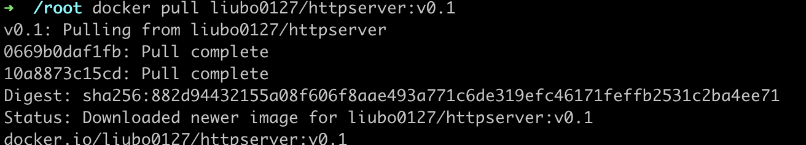

# 下载镜像

```shell
$ docker pull liubo0127/httpserver:v0.1
```

> 

# 运行

```shell
$ docker run --name httpserver -itd liubo0127/httpserver:v0.1
```

> 

# 获取 ip

```shell
# 获取 PID，方法 1
$ lsns -t net

# 获取 PID，方法 2
$ docker inspect --format "{{ .State.Pid }}" httpserver

# 查看 IP
$ nsenter -t 657725 -n ip a
```

> 
> 